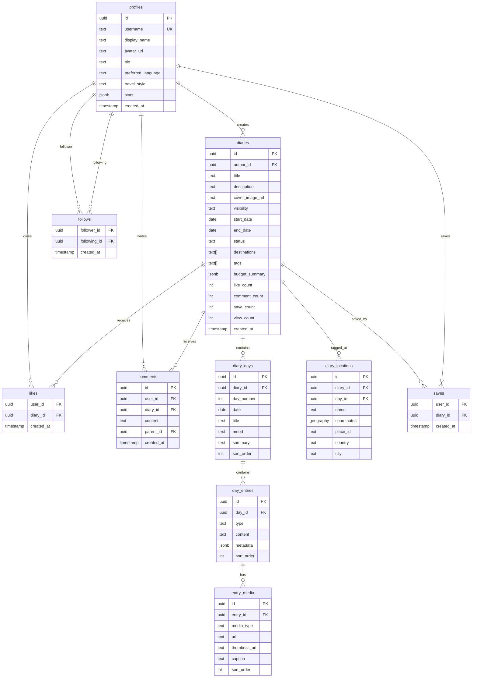

# T2T — Travel to Tell: Piano di Implementazione MVP

## Obiettivo

Costruire l'MVP dell'app mobile **T2T — Travel to Tell**, un social network per viaggiatori con formato diario di viaggio. L'app sarà mobile nativa (React Native + Expo) con backend Supabase.

> [!IMPORTANT]
> Partiamo dal **backend** (Supabase) perché è la fondazione. Poi costruiamo l'app mobile sopra.

## Strategia di Sviluppo

Approccio **bottom-up incrementale**:
1. 🗄️ **Database schema** → la struttura dati
2. 🔐 **Auth & Security** → RLS policies
3. 📱 **Mobile project setup** → Expo + navigazione
4. ✍️ **Diary CRUD** → il cuore dell'app
5. 📸 **Media upload** → foto e video
6. 👥 **Social layer** → follow, like, commenti
7. 📰 **Feed & Discovery** → homepage
8. 🗺️ **Mappa** → Google Maps integration

---

## Fase 1 — Backend Supabase

### Schema Database

> [!NOTE]
> Usiamo PostGIS per la geolocalizzazione. Tutte le tabelle hanno RLS abilitato.



### Migrazioni da applicare

1. **`enable_extensions`** — Abilita PostGIS e pg_trgm
2. **`create_profiles`** — Tabella profili + trigger auto-create da auth
3. **`create_diaries`** — Tabella diari con visibility e status
4. **`create_diary_days`** — Giorni/capitoli del diario
5. **`create_day_entries`** — Contenuti (testo, foto, video) per ogni giorno
6. **`create_entry_media`** — Media associati alle entry
7. **`create_diary_locations`** — Luoghi con coordinate PostGIS
8. **`create_social_tables`** — follows, likes, comments, saves
9. **`create_rls_policies`** — Row Level Security per tutte le tabelle
10. **`create_storage_buckets`** — Bucket per avatars, diary-media

### Storage Buckets

| Bucket | Accesso | Uso |
|--------|---------|-----|
| `avatars` | Pubblico (lettura), Auth (scrittura proprio file) | Foto profilo |
| `diary-media` | Condizionale (visibilità diario), Auth (scrittura) | Foto/video dei diari |

---

## Fase 2 — Setup Progetto Mobile

### Setup Expo + React Native

```
npx create-expo-app@latest ./  --template blank-typescript
```

### Struttura Cartelle

```
t2t-app/
├── app/                    # Expo Router (file-based routing)
│   ├── (auth)/             # Auth screens
│   │   ├── login.tsx
│   │   └── register.tsx
│   ├── (tabs)/             # Main tab navigator
│   │   ├── index.tsx       # Feed
│   │   ├── explore.tsx     # Discovery
│   │   ├── create.tsx      # New diary
│   │   ├── map.tsx         # Mappa personale
│   │   └── profile.tsx     # Profilo
│   └── diary/
│       ├── [id].tsx        # Diary detail
│       └── edit/[id].tsx   # Diary editor
├── components/             # Componenti riutilizzabili
├── hooks/                  # Custom hooks
├── lib/                    # Supabase client, utilities
├── i18n/                   # Traduzioni EN/IT
├── constants/              # Colori, dimensioni, config
└── types/                  # TypeScript types (generati da Supabase)
```

### Dipendenze Chiave

- `@supabase/supabase-js` — Client Supabase
- `expo-router` — Navigazione file-based
- `expo-image-picker` — Selezione foto/video
- `expo-location` — Geolocalizzazione
- `react-native-maps` — Google Maps
- `expo-localization` + `i18next` — Internazionalizzazione
- `expo-secure-store` — Token storage sicuro
- `react-native-reanimated` — Animazioni fluide

---

## Fase 3 — Core Features MVP

### 3.1 Auth Flow
- Registrazione con email/password
- Login con email/password
- Social login (Google, Apple) — fase successiva
- Onboarding: scegli username, avatar, stile di viaggio
- Persistenza sessione con SecureStore

### 3.2 Diary CRUD — ✅ Completato
- **Crea diario**: titolo, date, destinazioni, copertina
- **Aggiungi giorni**: uno per ogni giorno di viaggio
- **Editor giorno**: blocchi di contenuto drag & drop
  - Blocco testo (rich text)
  - Blocco foto (singola o galleria)
  - Blocco video (player inline) — 🔜 Da implementare
  - Blocco "tip" (consiglio strutturato)
  - Blocco "mood" (emoji + nota)
  - Blocco "location" (tag luogo)
- **Visibility**: Pubblico / Solo amici / Solo link / Privato
- **Status**: Bozza / Pubblicato
- **Offline drafts**: salvataggio locale con sync

### 3.3 Media Upload
- Compressione immagini client-side prima dell'upload
- Generazione thumbnail per video
- Upload diretto a Supabase Storage con progress bar
- Limite: immagini fino a 10MB, video fino a 100MB (1 min nel feed)

### 3.4 Social Layer
- **Follow/Unfollow** con contatori ottimistici
- **Like** con animazione cuore
- **Commenti** con threading (risposte)
- **Salva diario** in raccolta personale
- **Condividi** link al diario / deep link

### 3.5 Feed & Discovery — ✅ Completato (Home Feed)
- **Home feed**: diari dai viaggiatori seguiti/pubblici (cronologico)
- **Explore**: diari popolari, trending, per destinazione — 🔜 Placeholder
- **Cerca**: per destinazione, tag, utente
- Card preview: copertina, titolo, autore, destinazioni, like

---

## Fase 4 — Mappa Interattiva

- Google Maps con markers personalizzati per ogni luogo visitato
- Mappa nel profilo → tutti i tuoi luoghi
- Mappa nel diario → percorso del viaggio
- Tap marker → preview del capitolo

---

## Verification Plan

### Test Automatici

**Backend (SQL)**
- Verifica che tutte le migrazioni applicano correttamente
- Query di test per CRUD su ogni tabella
- Verifica RLS: utente A non può modificare diari di utente B
- Verifica trigger auto-create profilo da auth signup

**Mobile (Jest + React Native Testing Library)**
- Test unitari per hooks custom
- Test componenti UI principali
- Test navigazione tra schermate

> [!NOTE]
> I test verranno implementati progressivamente man mano che costruiamo ogni feature. Comando di esecuzione: `npx expo test` o `npx jest`.

### Verifica Manuale

1. **Supabase Dashboard** — Dopo ogni migrazione, verificare lo schema nella dashboard Supabase
2. **Expo Go** — Testare l'app su dispositivo fisico tramite Expo Go durante lo sviluppo
3. **Flow critico**: Registro → Creo diario → Aggiungo giorni → Carico foto → Pubblico → Visibile nel feed
